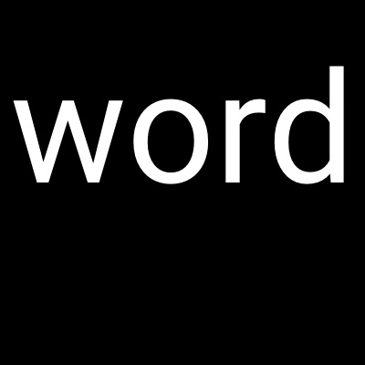
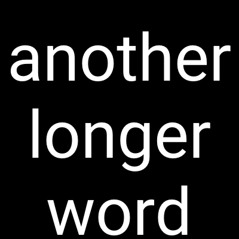

# Tiermaker Image Generator

## What does it do?
This is a simple program that generates black images with white text for each line in a text file. It was made to be used with [tiermaker](https://tiermaker.com/), but can be used for any purpose where having images is more desirable than text.

## How do I use it?
- Create a file `text.txt` and enter every line of text you want to have an image for, with one line per image. Spaces in each line will be converted to a line break in the image.
- Add your desired font as `font.ttf` in this directory.
- Run `go run main.go`.
- Your images will be stored in the `/img` directory

## Examples
### Content of `text.txt`
```
word
another longer word
incrediblylongword
```

### Resulting images




## Dependencies
You need to have the go compiler installed to use this. Visit [golang's website](https://go.dev/) to find the install instructions for your system.
